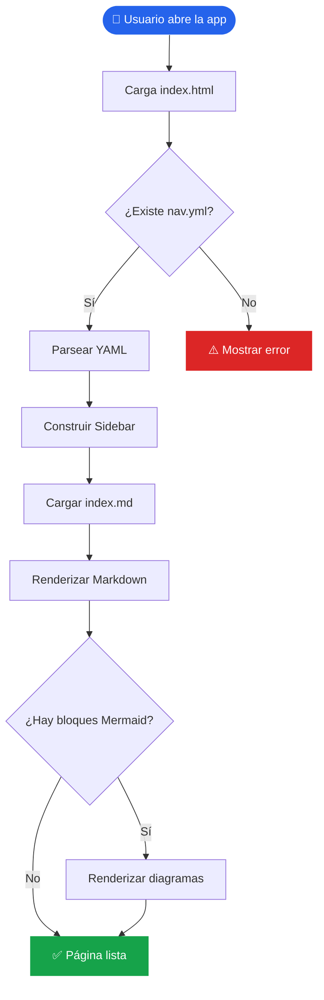
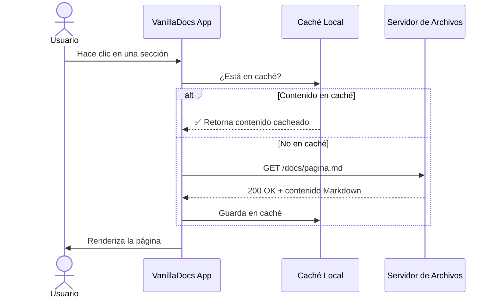
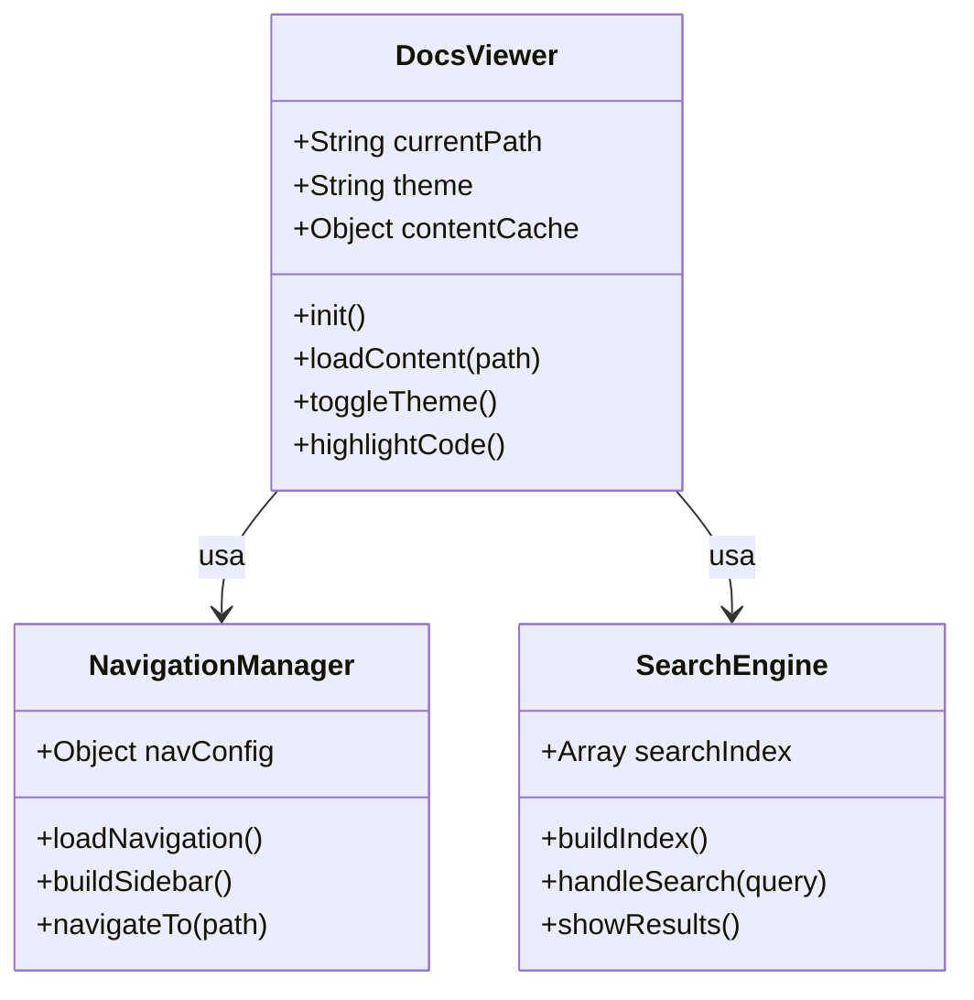
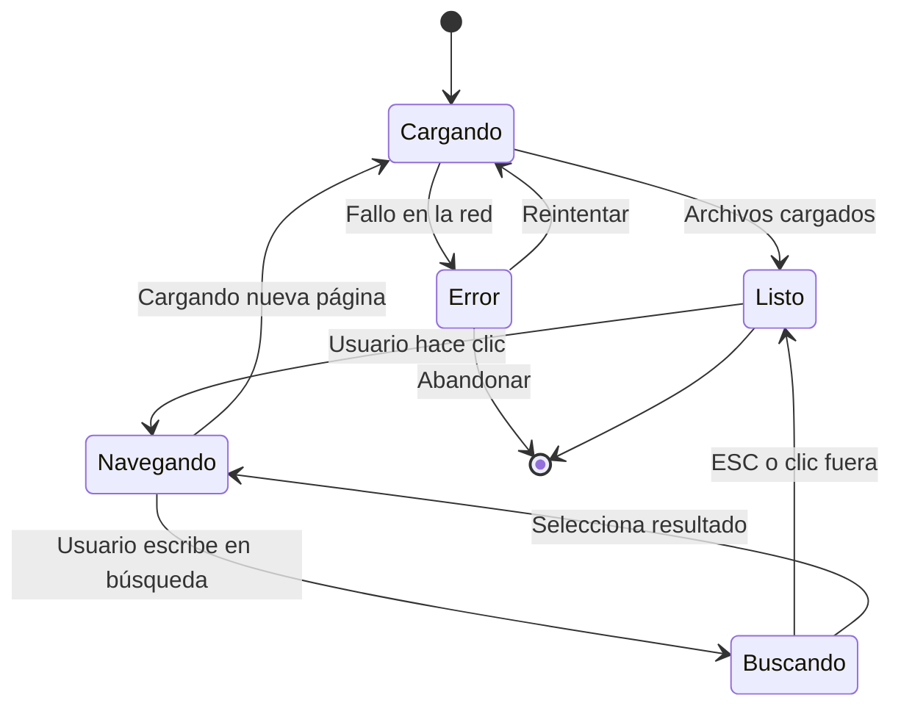
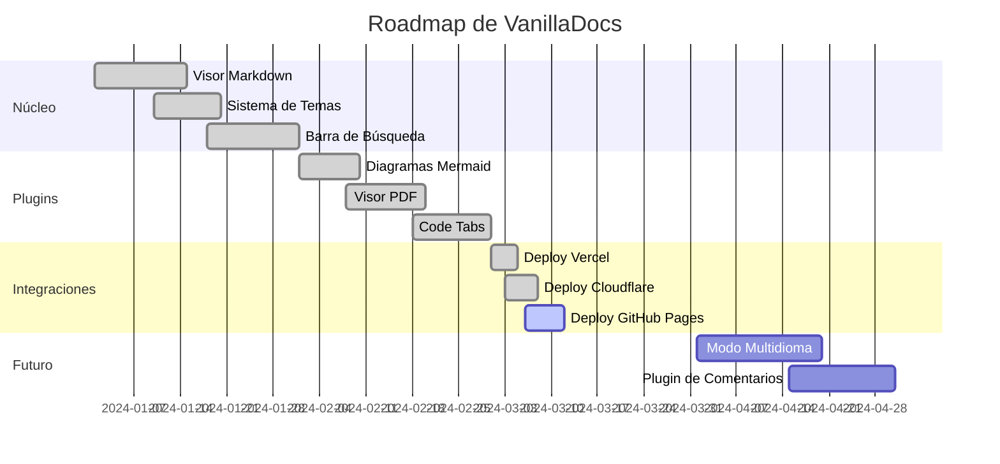
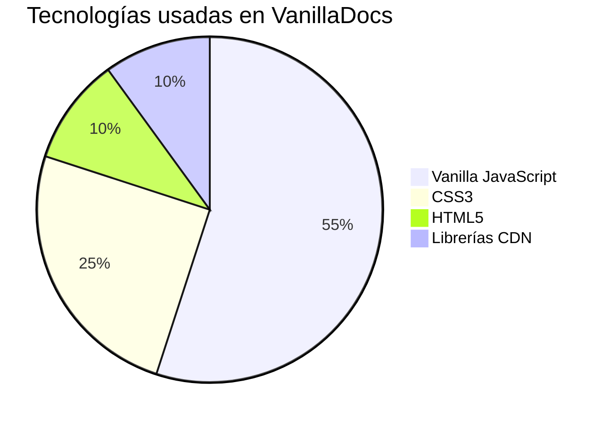

# Diagramas con Mermaid.js

VanillaDocs tiene soporte nativo para **Mermaid.js**, lo que te permite crear diagramas visuales directamente en tus archivos Markdown sin necesitar herramientas externas ni imágenes.

Simplemente escribe un bloque de código usando ` ```mermaid ` como lenguaje y el sistema lo renderizará automáticamente.

---

## Diagrama de Flujo (Flowchart)

Ideal para representar procesos, decisiones o flujos de datos.



---

## Diagrama de Secuencia

Perfecto para documentar APIs, autenticación o interacciones entre servicios.



---

## Diagrama de Clases

Útil para documentar arquitectura de software o modelos de datos.



---

## Diagrama de Estado (State Diagram)

Representa el ciclo de vida de un objeto o proceso.



---

## Diagrama de Gantt (Planificación de Proyecto)

Ideal para roadmaps o cronogramas de desarrollo.



---

## Diagrama de Pastel (Pie Chart)

Para mostrar distribuciones o estadísticas de forma visual.



---

## Cómo Usarlo

Inserta cualquiera de estos diagramas en tus archivos `.md` envueltos en un bloque de código `mermaid`:

````markdown

````

::: tip
Visita [mermaid.js.org](https://mermaid.js.org/) para explorar todos los tipos de diagramas disponibles y su sintaxis completa.
:::

::: info
Los diagramas se renderizan en el cliente usando **Mermaid.js** directamente desde el navegador. No necesitas ningún servidor ni proceso de compilación.
:::
